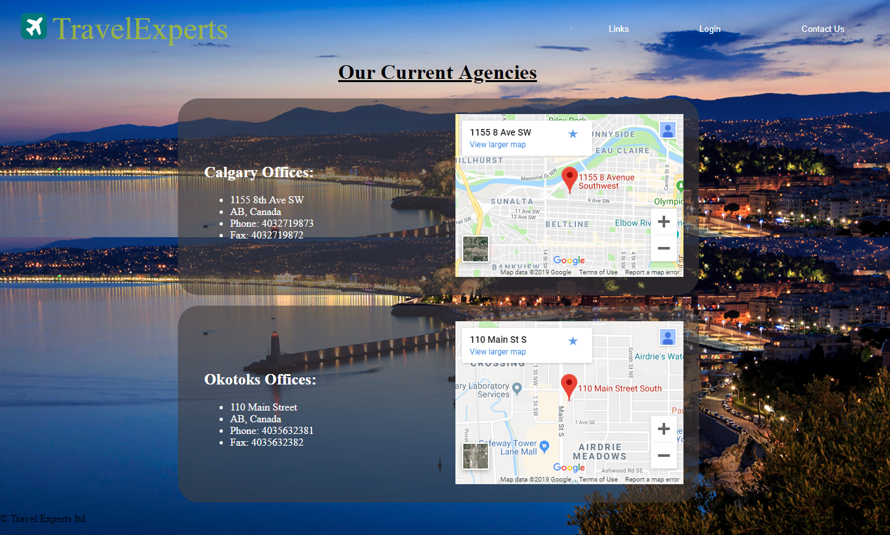

# TravelExperts-website

## Overview
Server-side processing with PHP and MySQL

Developed dynamically generated, database-driven web application with PHP scripts which provided customer
registration and sign in functionalities as well as capturing form data from customers.  

### Index Page

### Packages Page
List of packages are dynamically retrieved from database and processed based on package start date and end date

### Customer Registration Page
Customer information is captured by HTML Form and processed by PHP script and stored in MySQL database

### Login Pages
Customers as well as Travel Agents are able to login, customer/agent usernames and passwords are temporarily stored inside a `.csv` file

| Customer Login| Agent Login   |
| ------------- | ------------- |
|   |   |

### Contacts Page
Display Travel agency locations via google maps

